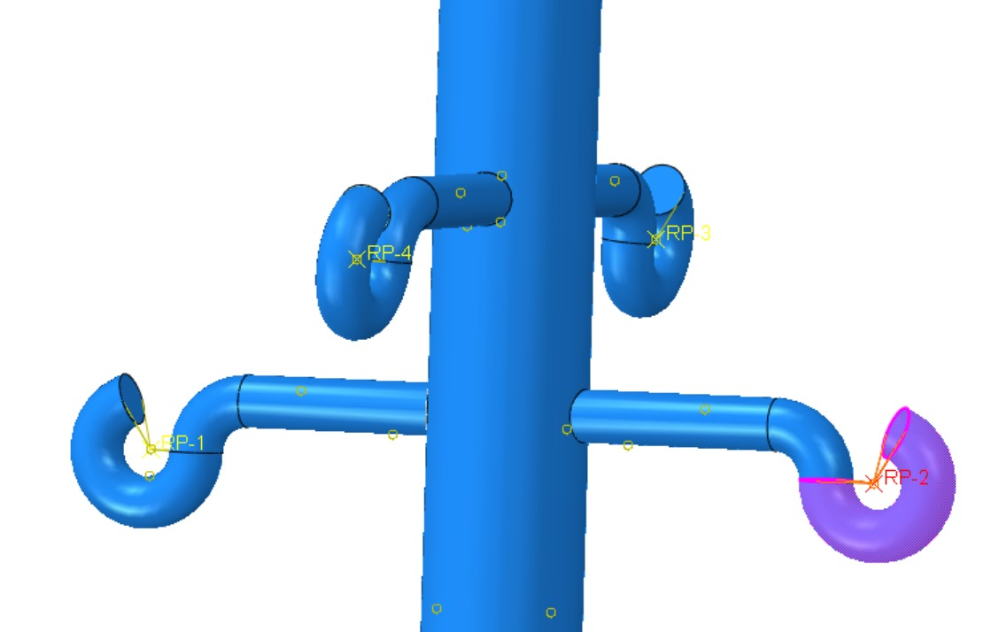
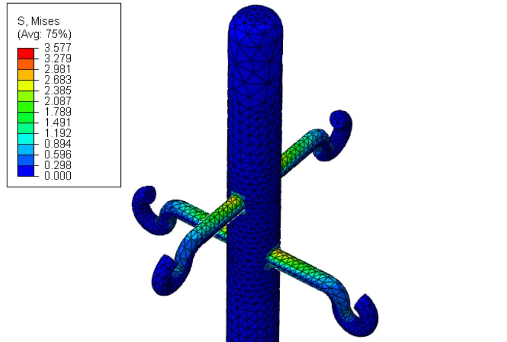
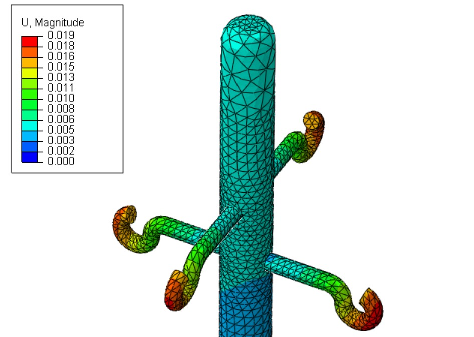
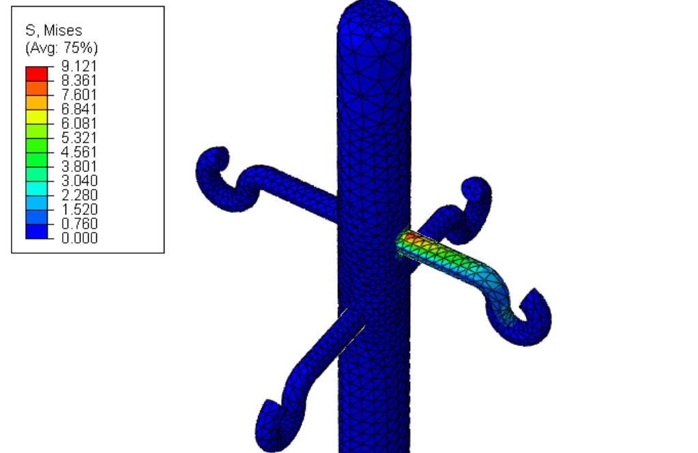
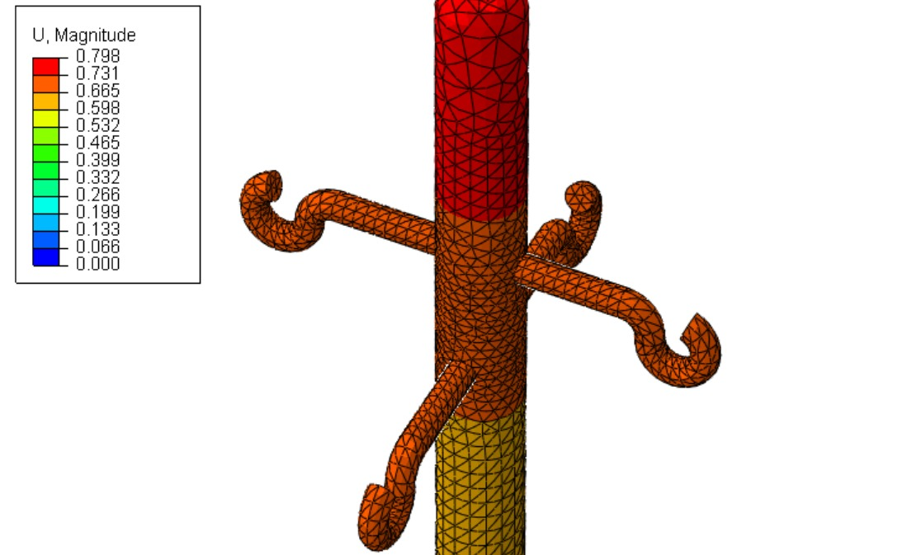
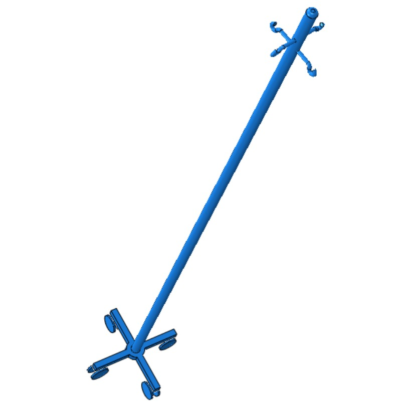
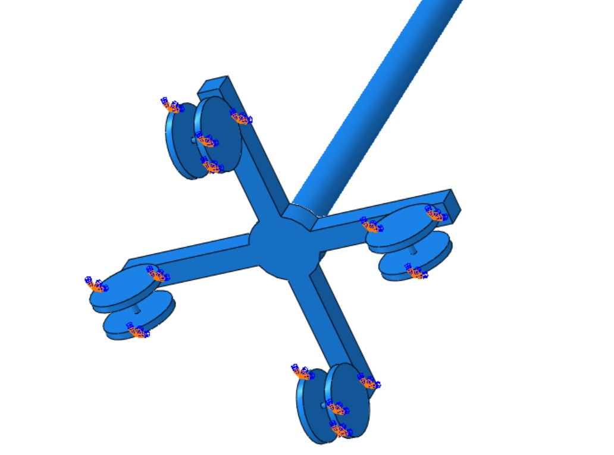
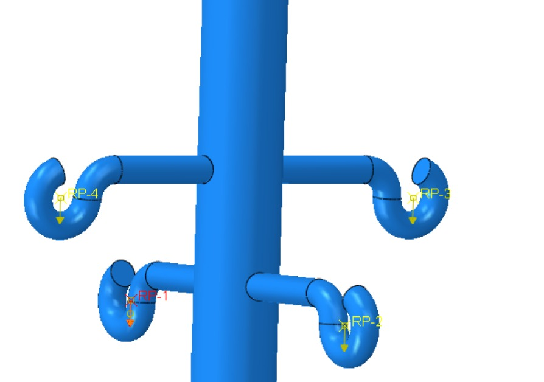
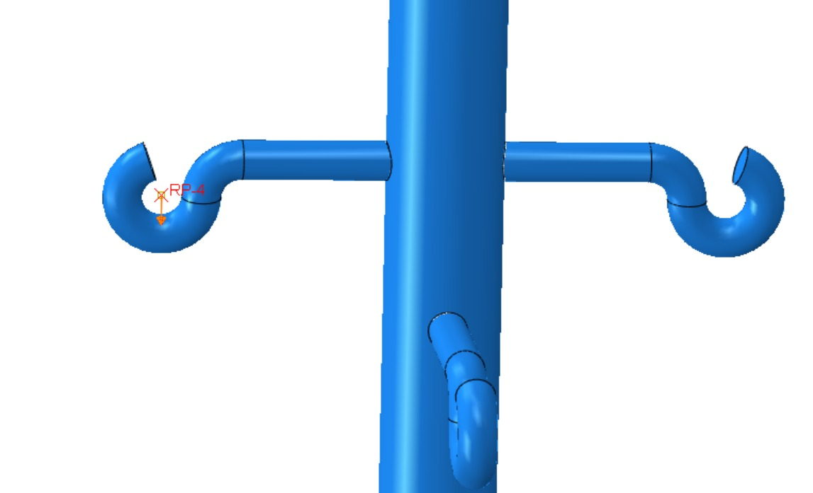
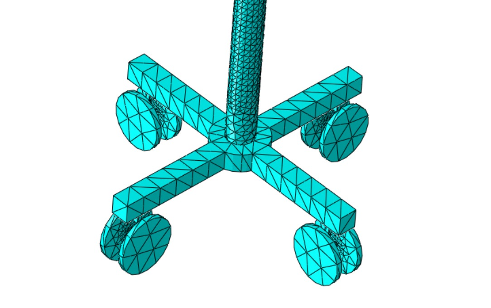

# abaqus-medical-iv-stand
Finite element analysis of a medical IV stand under symmetric and asymmetric hook loading using Abaqus/CAE.
# Medical IV Stand — FEA Study

## Overview
This project presents a finite element analysis of a medical IV stand assembly under two different loading conditions.
The CAD geometry was created in PTC Creo by a colleague and imported into Abaqus/CAE, where I built the assembly and performed the structural analysis to evaluate the response under balanced and asymmetric loading on the upper hooks.
Two load cases were investigated:
* **Symmetric loading:** 5 N applied to each of the four hooks (20 N total);
* **Single-hook loading:** 15 N applied to a single hook.

## Objective
The FEA was used to:
* evaluate the maximum von Mises stress for both loading configurations;
* assess the maximum total displacement of the stand;
* compare the structural response under symmetric and asymmetric loading;
* observe the effect of eccentric loading on bending behavior;
* evaluate load transfer through the upper hook assembly, central pole, and supporting base.

## My Contribution
Starting from the provided CAD geometry, I developed the FEA setup in **Abaqus/CAE**, including:
* assembly of the imported components;
* material definition;
* boundary conditions and assembly constraints;
* reference points and coupling setup for load application;
* definition of both load cases and analysis setup;
* mesh verification;
* post-processing and interpretation of the results.

## Software and Tools
* Abaqus/CAE
* PTC Creo Parametric

## Material
An isotropic linear elastic **AlSi** material model was used for the components.

| Property | Value |
| :--- | ---: |
| Young's modulus | 70000 MPa |
| Poisson's ratio | 0.33 |

A homogeneous solid section was assigned to the analyzed components.

## FEA Setup
A `Static, General` analysis step was used for both load cases.

### Boundary Conditions & Interactions
* **Fixed support:** The lower region of the stand was constrained using an **ENCASTRE** boundary condition (restraining all six degrees of freedom).
* **Assembly constraints:** **Tie constraints** were applied at component interfaces to represent rigid connections without relative motion.
* **Load application:** A **Continuum distributing coupling** was used to distribute the load from each reference point to the selected nodes on the corresponding hook.
A surface-based coupling could not be applied directly to the hooks because of the available geometry and surface definition. Instead, I selected the available nodes located at the circular profile regions at the beginning and end of the hook. This node-based selection captured the corresponding hook region for the load distribution.

### Load Cases
* **Load Case 1 (Symmetric):** 5 N applied vertically to each of the four hooks.
* **Load Case 2 (Single-hook):** 15 N applied vertically to a single hook, creating an asymmetric, eccentric load.

## Mesh
The imported geometry was pre-discretized using tetrahedral elements. I checked the existing mesh before running the analyses. A few local mesh-quality warnings related to element aspect ratio were present, mainly around the more complex geometry near the base and caster connections.
These regions are away from the main areas of interest in this study, namely the upper hook assembly and central pole. The analyses completed successfully, and the mesh was therefore retained for the presented simulations.

## Results

### Load Case 1 — Symmetric Loading (5 N / hook)
| Parameter | Value |
| :--- | ---: |
| Total applied load | 20 N |
| Maximum von Mises stress | ~3.57 MPa |
| Maximum total displacement | ~0.019 mm |

The symmetric distribution of the loads results in a predominantly balanced response of the structure. The resulting displacement is very small, while the stress distribution remains relatively low throughout the assembly.

#### Stress & Displacement

### Load Case 2 — Single-Hook Loading (15 N)
| Parameter | Value |
| :--- | ---: |
| Total applied load | 15 N |
| Maximum von Mises stress | ~9.12 MPa |
| Maximum total displacement | ~0.798 mm |

Although the total applied force is lower than in the symmetric case, applying it to a single hook produces a considerably different structural response.
The eccentric load introduces a bending effect in the central pole, which results in a substantially larger displacement. The highest stress regions occur around the loaded hook and near the connection between the pole and the supporting base.

#### Stress & Displacement

## Comparison
| Parameter | Symmetric Loading | Single-Hook Loading |
| :--- | ---: | ---: |
| Load configuration | 5 N × 4 hooks | 15 N × 1 hook |
| Total applied load | 20 N | 15 N |
| Maximum von Mises stress | ~3.57 MPa | ~9.12 MPa |
| Maximum displacement | ~0.019 mm | ~0.798 mm |

Concentrating the load on a single hook introduces a significant bending moment in the central pole. Despite a lower total applied force (15 N vs 20 N), single-hook loading increases maximum von Mises stress by **~2.6×** and total displacement by **~42×**.

## Conclusions
Under the symmetric 5 N per hook configuration, the structure exhibits very small displacement and a relatively low stress level. When 15 N is applied to a single hook, the resulting eccentric loading produces a considerably larger bending response, increasing both the maximum stress and total displacement.
The comparison demonstrates the importance of considering not only the magnitude of the applied load, but also its position and distribution when evaluating the structural response of an assembled component.

## Selected Results
### FEA Model

### Boundary Conditions and Loading

#### Load Case 1 (Symmetric)

#### Load Case 2 (Single-hook)

### Mesh

