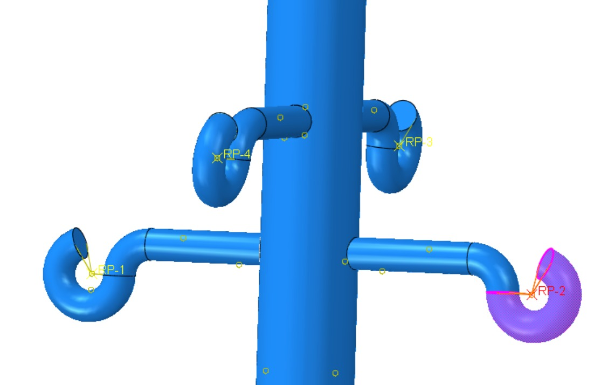
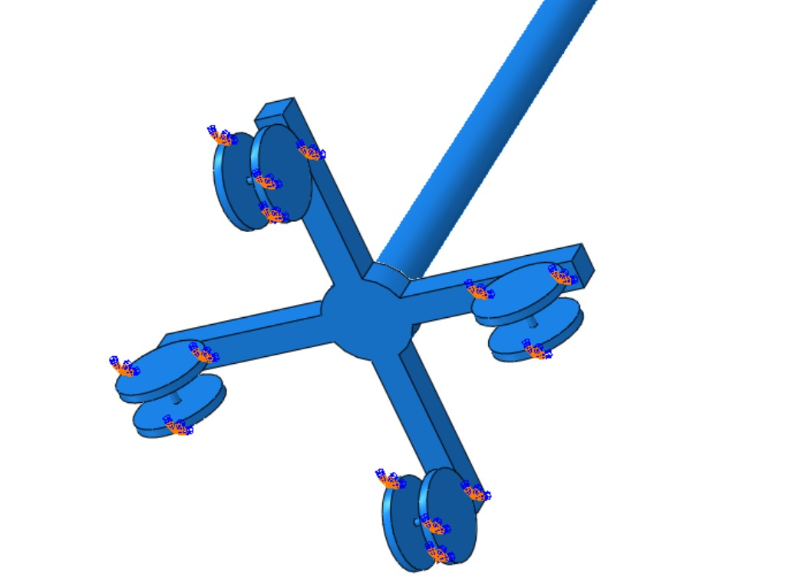
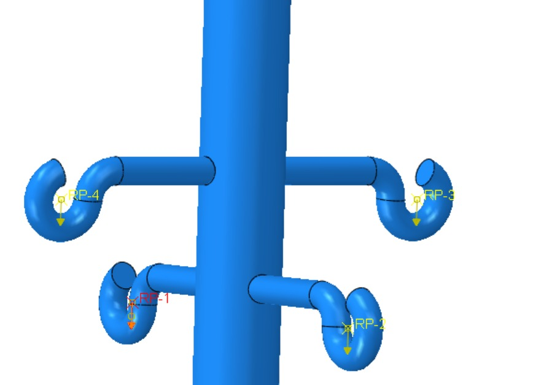
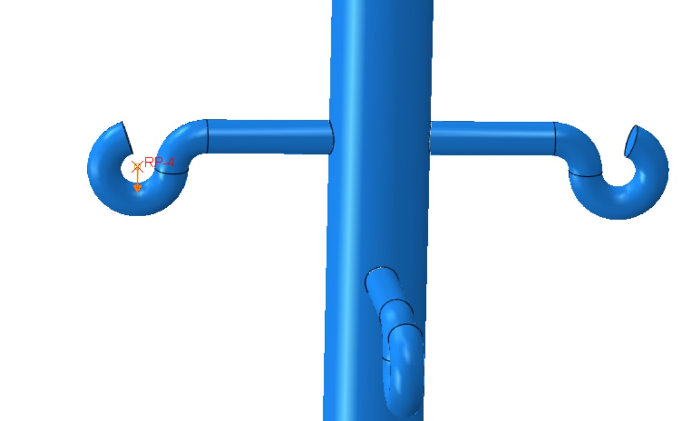
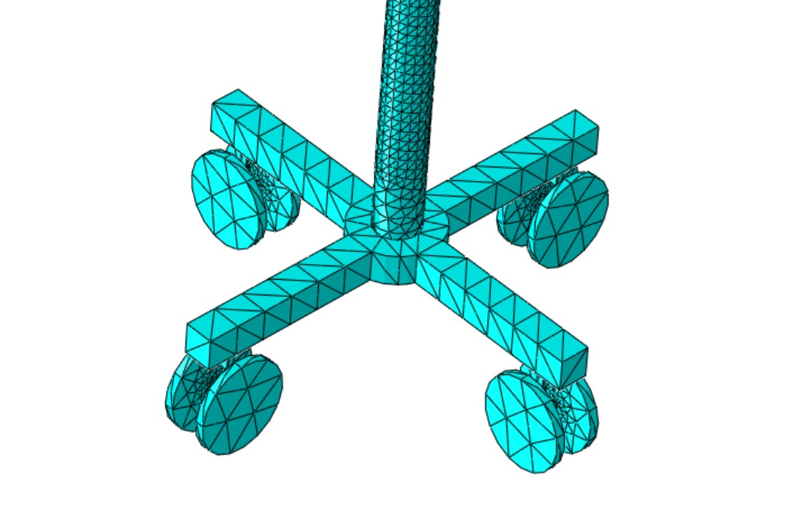
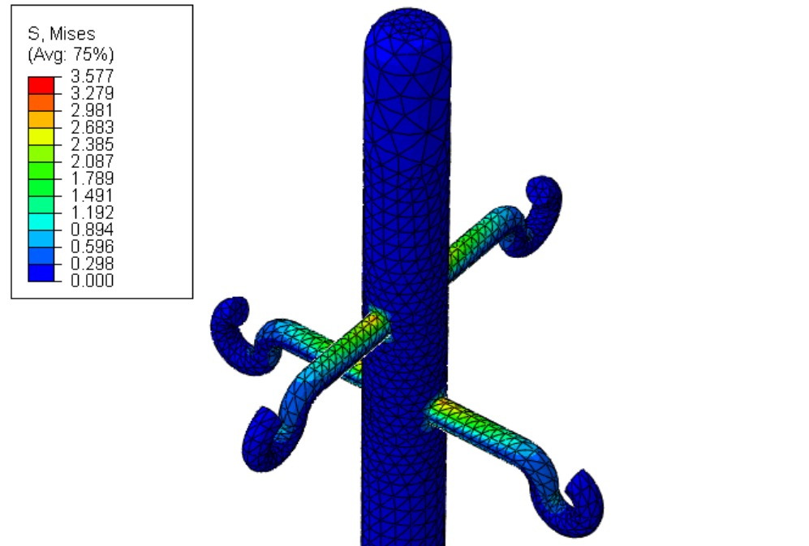
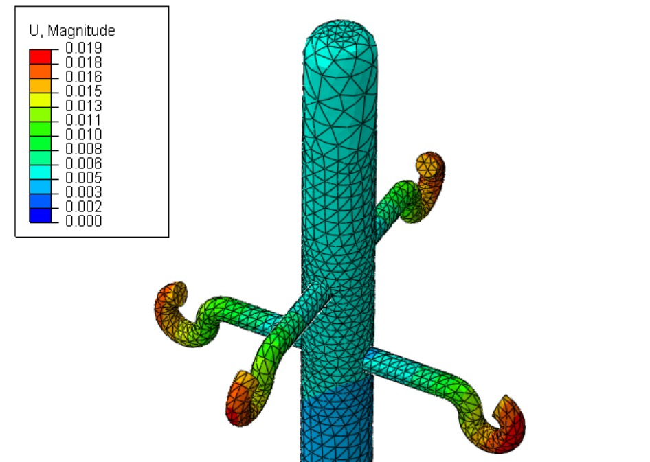
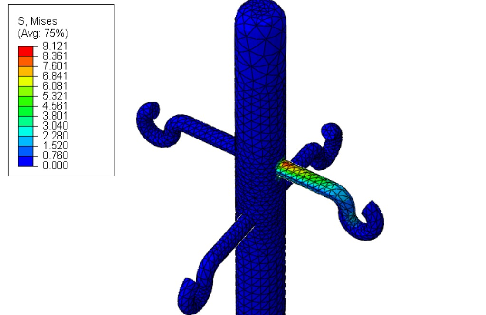
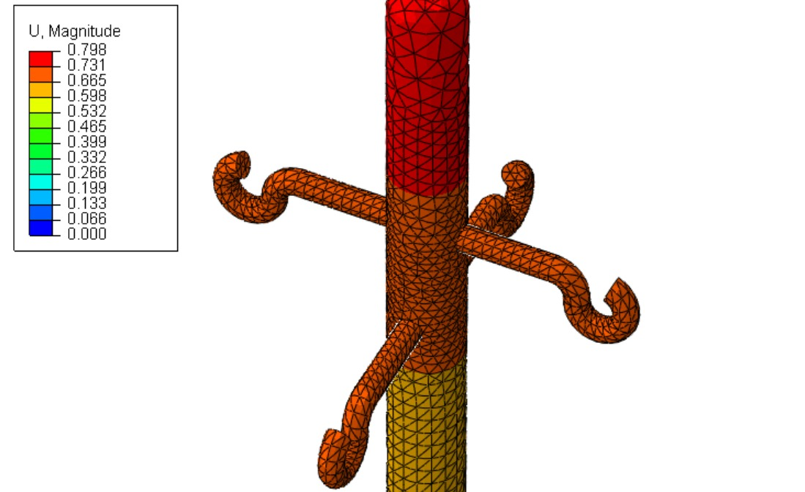

# abaqus-medical-iv-stand
Finite element analysis of a medical IV stand under symmetric and asymmetric hook loading using Abaqus/CAE.
# Medical IV Stand — FEA Comparative Study

## Overview
This project presents a structural finite element analysis (FEA) evaluating the mechanical response of a medical IV stand assembly under symmetric and asymmetric (eccentric) payload distributions.

The CAD model was created in PTC Creo Parametric by a colleague and imported into **Abaqus/CAE**, where I developed the structural assembly setup, defined node-based continuum distributing couplings, and performed a comparative investigation between two operational load cases: a **20 N symmetric load** across four hooks and a **15 N asymmetric load** on a single hook.

---

## Key Engineering Highlights
* **Eccentric Bending Sensitivity:** Demonstrated that load position is far more critical than total weight—a 15 N single-hook load induces a **2.6× increase in peak von Mises stress** and a **42× increase in total deflection** compared to a balanced 20 N load.
* **Boundary Node Coupling Strategy:** Overcame surface-based coupling limitations on complex hook geometries by implementing a Continuum Distributing Coupling over selected circular boundary nodes, preventing artificial stress singularities at load entry points.
* **Lightweight Aluminum Alloy:** Assigned isotropic linear elastic AlSi properties (E = 70,000 MPa, Poisson ratio = 0.33), confirming that stresses remain well within the elastic regime for both configurations.
* **Comparative Load Scenarios:** Evaluated bending moment propagation from the upper hook assembly down through the central telescopic pole into the base connection.

---

## Objective
The primary goals of this numerical study were:
* Compare structural performance between balanced (4-hook) and eccentric (1-hook) loading.
* Evaluate maximum von Mises stress locations and magnitude variations across both load cases.
* Quantify peak pole deflection and overall assembly compliance under eccentric bending moments.
* Validate load distribution and transmission through assembly tie interfaces.

---

## My Contribution
Starting from the imported CAD assembly, I developed the complete numerical workflow in Abaqus/CAE, including:
* **Assembly & Material Assignment:** Configured part instances and assigned AlSi material section properties.
* **Node-Based Coupling Formulation:** Selected circular profile boundary nodes to set up continuum distributing couplings for hook load distribution.
* **Boundary Conditions & Ties:** Implemented ENCASTRE fixed constraints at the base and Tie constraints at component assembly interfaces.
* **Multi-Case Step Setup:** Configured parallel static general steps for symmetric and single-hook load cases.
* **Post-Processing & Comparative Analysis:** Analyzed stress concentration shifts and displacement magnification ratios.

---

## Software and Tools
* **Abaqus/CAE** (FEA assembly setup, solver & post-processing)
* **PTC Creo Parametric** (Original CAD modeling)

---

## Model Setup & Coupling Idealization
Due to geometric surface topology constraints on the upper hooks, surface-based couplings could not be directly assigned. To ensure physically accurate force distribution without localized mesh distortion:
* I defined Reference Points at each hook application center.
* A **Continuum Distributing Coupling** was established by manually selecting the ring of circular boundary nodes at the start and end profiles of each hook.

---

## Material Properties
All components were assigned an isotropic linear elastic material model representing an **Aluminum-Silicon (AlSi)** casting alloy.

| Property | Value |
| :--- | ---: |
| Material | AlSi Alloy |
| Young's modulus (E) | 70,000 MPa |
| Poisson's ratio | 0.33 |

---

## FEA Setup & Load Cases

### Boundary Conditions & Assembly Interfaces
* **Fixed Base:** An **ENCASTRE** boundary condition (restraining all 6 DOFs) was applied to the lower support region of the stand.
* **Assembly Interactions:** Rigid connections between the central pole, hook hub, and base structure were modeled using **Tie constraints**.

---

### Load Case Definitions
Two distinct operational configurations were evaluated in `Static, General` steps:

1. **Load Case 1 — Symmetric Loading (20 N Total):**
   * A vertical load of **5 N** applied to each of the four hooks via dedicated Reference Points.
2. **Load Case 2 — Single-Hook Loading (15 N Total):**
   * A vertical load of **15 N** applied to a single hook, creating an eccentric, asymmetric loading condition.

---

## Mesh Verification
The assembly was pre-discretized using 3D tetrahedral elements. I conducted a pre-analysis mesh check which identified minor aspect ratio warnings in non-critical caster/base geometry regions. Because these localized warnings were located far from the main load path (upper hooks and central pole) and the analysis converged smoothly, the mesh was validated for production runs.

---

## Results & Comparative Discussion

### Load Case 1 vs. Load Case 2 Comparison

| Parameter | Load Case 1 (Symmetric) | Load Case 2 (Single-Hook) | Relative Impact |
| :--- | ---: | ---: | :--- |
| **Load Configuration** | **5 N × 4 hooks** | **15 N × 1 hook** | Asymmetric shift |
| **Total Applied Load** | **20 N** | **15 N** | **25% lower total force** |
| **Max von Mises Stress** | **3.57 MPa** | **9.12 MPa** | **2.55× Stress Increase** |
| **Max Total Displacement** | **0.019 mm** | **0.798 mm** | **42.0× Deflection Increase** |

---

### Load Case 1 — Symmetric Loading (20 N)
Under symmetric loading, forces cancel out across the central axis, resulting in negligible pole bending and uniform stress distribution.
* **Max von Mises Stress:** ~3.57 MPa (located near the hook attachment hub).
* **Max Displacement:** ~0.019 mm (virtually rigid structural response).

---

### Load Case 2 — Single-Hook Loading (15 N)
Applying 15 N to a single hook introduces an un-counterbalanced moment arm relative to the pole's neutral axis.
* **Max von Mises Stress:** ~9.12 MPa (concentrated at the loaded hook root and pole-to-base joint).
* **Max Displacement:** ~0.798 mm (pronounced lateral bending along the upper pole).

---

## Conclusions
1. **Dominance of Eccentricity:** Off-center payload placement is the primary driver of structural deformation and stress in IV stand structures. Concentrating 15 N on one hook produces **42× higher deflection** than spreading 20 N across four hooks.
2. **Stress Margin:** Maximum stress under asymmetric loading (9.12 MPa) remains well below the yield limit of AlSi alloy, confirming high structural safety under normal handling.
3. **Modeling Best Practice:** Using node-based continuum couplings on circular profiles successfully prevented artificial stress spikes, enabling accurate evaluation of bending moment transfer across the assembly.
